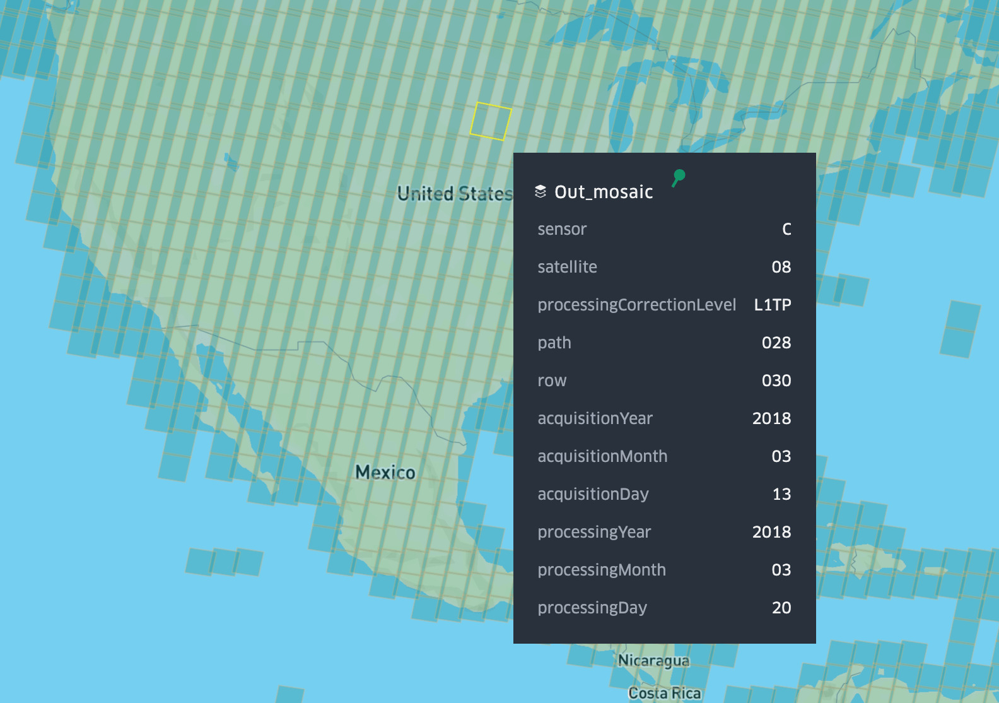

# CLI

### `create`

```
Usage: landsat-cogeo-mosaic create [OPTIONS] LINES

  Create MosaicJSON from STAC features

Options:
  --min-zoom INTEGER              Minimum zoom  [default: 7]
  --max-zoom INTEGER              Maximum zoom  [default: 12]
  --quadkey-zoom INTEGER          Zoom level used for quadkeys in MosaicJSON.
                                  Lower value means more assets per tile, but
                                  a smaller MosaicJSON file. Higher value
                                  means fewer assets per tile but a larger
                                  MosaicJSON file. Must be between min zoom
                                  and max zoom, inclusive.
  -b, --bounds TEXT               Comma-separated bounding box: "west, south,
                                  east, north"
  --optimized-selection / --no-optimized-selection
                                  Attempt to optimize assets in tile. This
                                  optimization implies that 1) assets will be
                                  ordered in the MosaicJSON in order of cover
                                  of the entire tile and 2) the total number
                                  of assets is kept to a minimum.  [default:
                                  True]
  --season [spring|summer|autumn|winter]
                                  Season, can provide multiple
  --help                          Show this message and exit.
```

#### Example

`features.json` is output from `landsat-cogeo-mosaic search`.

```bash
landsat-cogeo-mosaic create \
    --bounds '-127.64,23.92,-64.82,52.72' \
    --min-zoom 7 \
    --max-zoom 12 \
    --quadkey-zoom 8 \
    --optimized-selection \
    --season summer \
    features.json > mosaic.json
```

### `create-from-db`

Create MosaicJSON from SQLite database of Landsat features.

This is the fastest and most efficient way of creating a large Landsat
MosaicJSON, and I recommend it especially for global mosaics. But first you need
to create a local SQLite database of Landsat metadata.

#### Metadata Download

Make sure you're in the top-level folder of the repository. Then download the
metadata from S3. This is about a 500MB file (uncompressed) as of April 2020,
but it grows over time as new scenes are added.

```bash
aws s3 cp s3://landsat-pds/c1/L8/scene_list.gz data/
gunzip -c data/scene_list.gz > data/scene_list
```

#### Import into SQLite

I use SQLite to speed up processing with lots of data. The `csv_import.sql`
script creates a new table, imports the csv file, creates a couple new columns,
and creates indices. Note that the script must be run from the directory where
the file `scene_list` from above is stored.

```bash
cd data/
sqlite3 scene_list.db < ../scripts/csv_import.sql
cd -
```

The database takes up about 750MB, including indices.

#### API

```
Usage: landsat-cogeo-mosaic create-from-db [OPTIONS]

  Create MosaicJSON from SQLite database of Landsat features

Options:
  --sqlite-path PATH              Path to sqlite3 db generated from scene_list
                                  [required]
  --pathrow-index PATH            Path to pathrow-quadkey index  [required]
  --max-cloud FLOAT               Maximum cloud percentage  [default: 100]
  --min-date TEXT                 Minimum date, inclusive  [default:
                                  2013-01-01]
  --max-date TEXT                 Maximum date, inclusive  [default:
                                  2020-05-19]
  --min-zoom INTEGER              Minimum zoom  [default: 7]
  --max-zoom INTEGER              Maximum zoom  [default: 12]
  -p, --sort-preference [newest|oldest|closest-to-date|min-cloud]
                                  Method for choosing scenes in the same path-
                                  row  [default: newest]
  --closest-to-date TEXT          Date used for comparisons when preference is
                                  closest-to-date. Format must be YYYY-MM-DD
  --help                          Show this message and exit.
```

#### Example

```bash
landsat-cogeo-mosaic create-from-db \
    `# Path to the sqlite database file` \
    --sqlite-path data/scene_list.db \
    `# Path to the path-row to quadkey index file. This is stored in Git` \
    --pathrow-index data/pr_index.jsonl.gz \
    `# Min zoom of mosaic, 7 is a good default for Landsat` \
    --min-zoom 7 \
    `# Max zoom of mosaic, 12 is a good default for Landsat` \
    --max-zoom 12 \
    `# Maximum cloud cover. This means 5%` \
    --max-cloud 5 \
    `# Preference for choosing the asset for a tile` \
    --sort-preference closest-to-date \
    `# Date used for comparisons when preference is closest-to-date` \
    --closest-to-date '2018-04-01' \
    > mosaic.json
```

### `index`

```
Usage: landsat-cogeo-mosaic index [OPTIONS]

  Create optimized index of path-row to quadkey_zoom

Options:
  --wrs-path PATH         Path to Shapefile (.shp) of WRS2 polygons. You can
                          download then extract from here
                          https://www.usgs.gov/media/files/landsat-
                          wrs-2-descending-path-row-shapefile  [required]
  --scene-path PATH       Path to CSV of scene metadata downloaded from AWS
                          S3.  [required]
  -b, --bounds TEXT       force bounding box: "west, south, east, north"
                          [default: -180,-90,180,90]
  --quadkey-zoom INTEGER  Zoom level used for quadkeys in MosaicJSON. Lower
                          value means more assets per tile, but a smaller
                          MosaicJSON file. Higher value means fewer assets per
                          tile but a larger MosaicJSON file. Must be between
                          min zoom and max zoom, inclusive.  [default: 8]
  --help                  Show this message and exit.
```

#### Example

The index stored in the Git repository is created from the following. The output
is a gzipped, newline-delimited JSON file that maps path-rows to quadkeys at
zoom level 8.

```bash
landsat-cogeo-mosaic index \
    --wrs-path data/WRS2_descending_0/WRS2_descending.shp \
    --scene-path data/scene_list.gz \
    --quadkey-zoom 8 \
    | gzip \
    > data/pr_index.jsonl.gz
```

### `missing-quadkeys`

Find missing quadkeys within `bounds` that are over land. The `shp-path` expects
to point to the unzipped 10m [land polygons vector dataset
shapefile](https://www.naturalearthdata.com/downloads/10m-physical-vectors/10m-land/)
from Natural Earth.

```
Usage: landsat-cogeo-mosaic missing-quadkeys [OPTIONS] FILE

  Find quadkeys over land missing from mosaic

Options:
  --shp-path PATH             path to Natural Earth shapefile of land
                              boundaries  [required]
  -b, --bounds TEXT           force bounding box: "west, south, east, north"
  --simplify / --no-simplify  Reduce size of the output tileset as much as
                              possible by merging leaves into parents.
                              [default: True]
  --help                      Show this message and exit.
```

### `search`

Download metadata from a STAC API. This outputs newline-delimited GeoJSON
features. By default this searches the metadata of the Landsat 8 collection
using an API instance hosted by Development Seed.

```
Usage: landsat-cogeo-mosaic search [OPTIONS]

  Retrieve features from sat-api

Options:
  -b, --bounds TEXT               Comma-separated bounding box: "west, south,
                                  east, north"  [required]
  --min-cloud FLOAT               Minimum cloud percentage  [default: 0]
  --max-cloud FLOAT               Maximum cloud percentage  [default: 100]
  --min-date TEXT                 Minimum date  [default: 2013-01-01]
  --max-date TEXT                 Maximum date, inclusive  [default:
                                  2020-05-19]
  --period [day|week|month|year]  Time period. If provided, overwrites `max-
                                  date` with the given period after `min-
                                  date`.
  --period-qty INTEGER            Number of periods to apply after `min-date`.
                                  Only applies if `period` is provided.
                                  [default: 1]
  --season [spring|summer|autumn|winter]
                                  Season, can provide multiple
  --stac-collection-limit INTEGER
                                  Limits the number of items per page returned
                                  by sat-api.  [default: 500]
  --help                          Show this message and exit.
```

#### Example

```bash
landsat-cogeo-mosaic search \
    --bounds '-127.64,23.92,-64.82,52.72' \
    `# Maximum 10% cloud cover` \
    --max-cloud 10 \
    `# Imagery from 2019` \
    --min-date 2019-01-01 \
    --max-date 2020-01-01 \
    --season summer > features.json
```

Note that if the query would return more than 10,000 scenes, an error is
produced, as 10,000 is the [max the API can
return](https://github.com/sat-utils/sat-api/issues/225). However, since the
output is _newline-delimited_ GeoJSON, you can append features easily:

```bash
landsat-cogeo-mosaic search ... >> features.json
```

### `visualize`

Visualize Landsat mosaic in kepler.gl.



```
Usage: landsat-cogeo-mosaic visualize [OPTIONS] [MOSAIC_PATHS]...

  Visualize Landsat mosaic in kepler.gl

Options:
  -p, --wrs-path PATH  Path to Shapefile (.shp) of WRS2 polygons. You can
                       download then extract from here
                       https://www.usgs.gov/media/files/landsat-
                       wrs-2-descending-path-row-shapefile  [required]
  --api-key TEXT       Mapbox API key. Can also be read from the
                       MAPBOX_API_KEY environment variable.
  --help               Show this message and exit.
```
