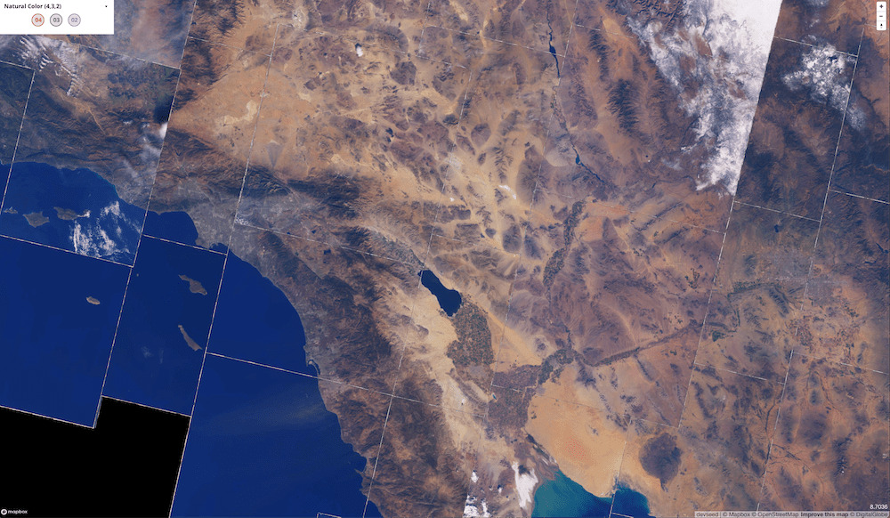

# landsat-cogeo-mosaic

`landsat-cogeo-mosaic` is a Python library and CLI to create and work with
MosaicJSON files.

[MosaicJSON][mosaicjson] is a specification that defines how to combine multiple
(satellite) imagery assets across time and space into web mercator tiles. These
files can then be used for on-the-fly satellite tile generation, using
[`landsat-mosaic-tiler`][landsat-mosaic-tiler].

[mosaicjson]: https://github.com/developmentseed/mosaicjson-spec
[landsat-mosaic-tiler]: https://github.com/developmentseed/landsat-mosaic-tiler
